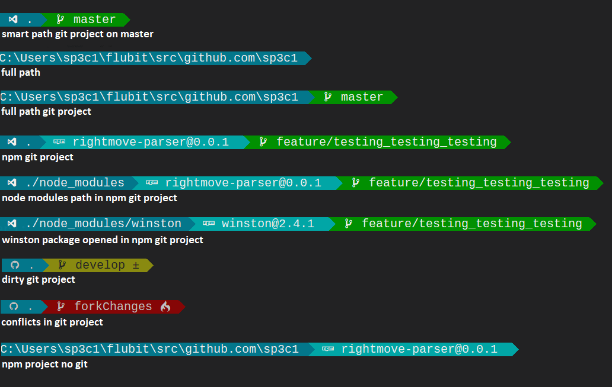

# Cmder-powerline-prompt

This is a custom prompt for [Cmder](http://cmder.net/) (the alternative console emulator for Windows). There's also a [PowerShell version](https://github.com/AmrEldib/cmder-powershell-powerline-prompt) of this prompt.  
It looks like this:  


It has a blue background for the prompt.  
For folders with git repos, you get yellow background for changes, and green for clean repos.  
I'm using Consolas font.

The look is inspired by [Powerline for Vim](https://github.com/powerline/powerline), and [Zsh's theme agnoster](https://github.com/agnoster/agnoster-zsh-theme).

Those are some of the functionalities that you can get:


# Requirements

Download the [AnonymousPro font](https://github.com/powerline/fonts/tree/master/AnonymousPro)  
You'll be able to use any font in Cmder, but this font contains the symbols included in the prompt.

## Font

To use another font and still show symbols correctly:

* Go to Cmder Settings > Main
* Choose Main console font to be what you prefer
* Choose _Alternative font_ to be _Anonymice Powerline_
* Modify the value of _Unicode ranges_ to add: `E0A0; E0B0;`
  * for extra symbols set in `powerline_config.lua` (like npm logo for node module or git project for smart path resolving) set the _Alternative font_ to one of your choosing.
    
* Save Settings

# Usage

Download the `.lua` files, and place it in `%CMDER_ROOT%/config` folder.  
Restart Cmder to load the prompt.

**Alternatively**, if you want to maintain link with the original repo, you can clone this repo into any folder  
`git clone https://github.com/AmrEldib/cmder-powerline-prompt.git git-repo-folder-name`  
then create a symbolic link from the `%CMDER_ROOT%/config` folder to the `.lua` file.

```
cd %CMDER_ROOT%/config  
mklink /H powerline_core.lua <git-repo-folder-name>/powerline_core.lua
mklink /H powerline_prompt.lua <git-repo-folder-name>/powerline_prompt.lua
```

To add Git prompt, add the Git file

```
mklink /H powerline_git.lua <git-repo-folder-name>/powerline_git.lua
```

To add Configurations, create a file named `_powerline_config.lua` that is a copy of the file `_powerline_config.lua.sample`

## Configuration

You can modify the prompt to display either the full path, the folder name or the smart path showing only local path below your current Git folder.
To do this, modify the value of the `promptValue` variable in the `_powerline_config.lua` setting `powerline_config_prompt_type` value.
The value could be either:

* `promptValueFull` for full path like `C:\Windows\System32`
* `promptValueFolder` for folder name only like `System32`
* `promptValueSmart` for folder `.` when in top of git project `C:\path\ProjectFromGit\`

`promptValueFull` is the default.

By setting `powerline_config_prompt_useHomeSymbol` to `true` in both smart and full mode you can force to shorten path in home directories to `~`.

# Helpful info for customizing Cmder

## Links

[Cmder Source Code and README](https://github.com/cmderdev/cmder)  
[What is Clink](https://github.com/AmrEldib/cmder-powerline-prompt/blob/master/docs/clink.md)  
[Clink Lua API](https://github.com/AmrEldib/cmder-powerline-prompt/blob/master/docs/clink_api.md)  
[ANSI Color Sequence](http://ascii-table.com/ansi-escape-sequences.php)

## Cmder Configurations

Cmder configurations is stored in `%CMDER_ROOT%\config\`  
You can add files to be loaded during startup in either of these folders  
 `%CMDER_ROOT%\config\profile.d`  
 `%CMDER_ROOT%\config`  
Add a `.ps1` file to be loaded for Powershell shells  
Add a `.bat` or `.cmd` files to be loaded for Windows Command shells  
Add a `.sh` file to be loaded for Bash shells  
User-specific configurations should go into files named `user-profile` with extensions `ps1`, `cmd`/`bat`, or `sh`.

## Clink Prompt

The file `%CMDER_ROOT%\vendor\clink.lua` sets the command prompt. See the function `set_prompt_filter`.
The prompt value is stored in [clink.prompt.value](https://github.com/mridgers/clink/blob/master/docs/api.md#clinkpromptvalue)  
Drop .lua files into the `%CMDER_ROOT%\Config` folder to customize the prompt.

# Status & Contribution

I published this code because it's not nice to keep it to myself. I fix problems that I encounter, and try to fix problems that others encounter if I have time.  
This code is provided with the timeless **Works on my Machine** gurentee.  
You can also check out the [pull requests page](/pulls) for contributions that didn't make back into this repo. These are fixes to problems I didn't encounter, or features not useful to me, but maybe useful to you.

People are very kind and contribute back fixes and improvements.  
This section is to acknowledage their contributions and thank them. If you find their contributions helpful to you, please take the time to thank them directly.

* [omniphx](https://github.com/omniphx) [#2](https://github.com/AmrEldib/cmder-powerline-prompt/pull/2)
* [umar-ahmed](https://github.com/umar-ahmed) [#6](https://github.com/AmrEldib/cmder-powerline-prompt/pull/6)
* [tvercruysse](https://github.com/tvercruysse) [#10](https://github.com/AmrEldib/cmder-powerline-prompt/pull/10)
* [igortg](https://github.com/igortg) [#24](https://github.com/AmrEldib/cmder-powerline-prompt/pull/24)
* [0NG](https://github.com/0NG) [#27](https://github.com/AmrEldib/cmder-powerline-prompt/pull/27)
* [mattdkerr](https://github.com/mattdkerr) [#29](https://github.com/AmrEldib/cmder-powerline-prompt/pull/29)
* [ivanjonas](https://github.com/ivanjonas) [#32](https://github.com/AmrEldib/cmder-powerline-prompt/pull/32)

I'd like to thank all who share their code with everyone for their time and effort.
